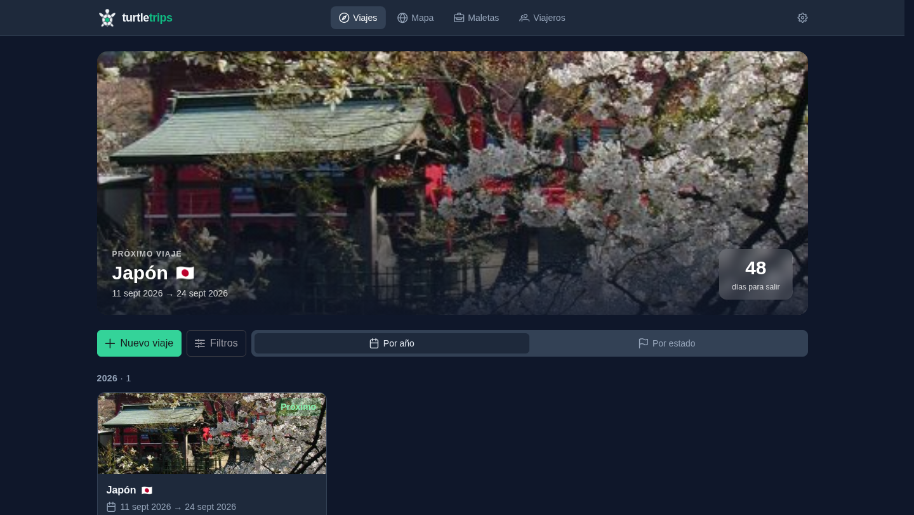
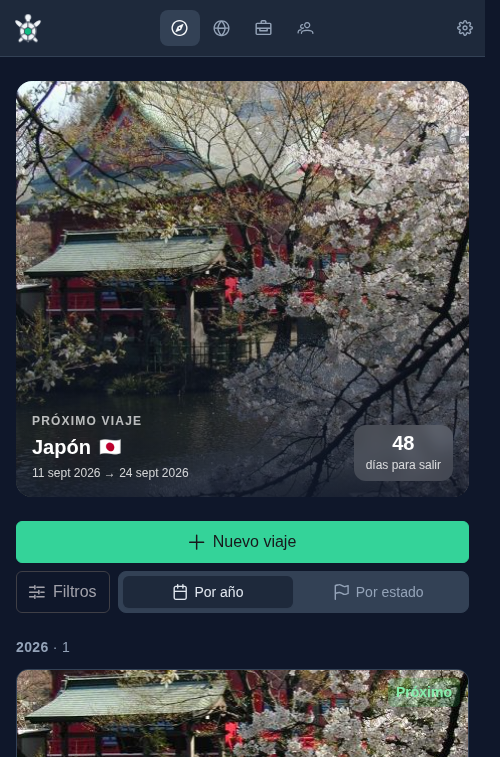
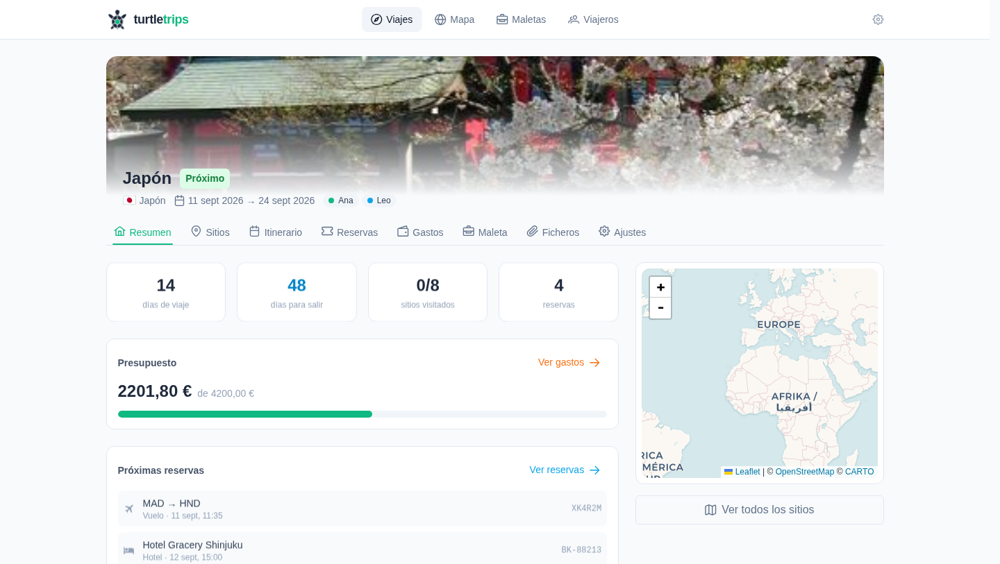
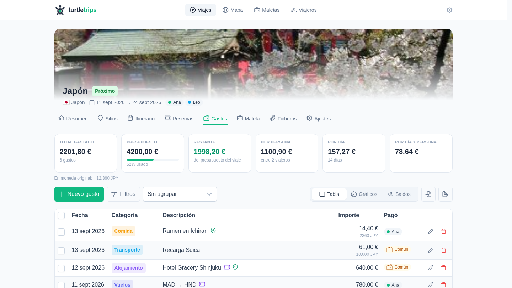
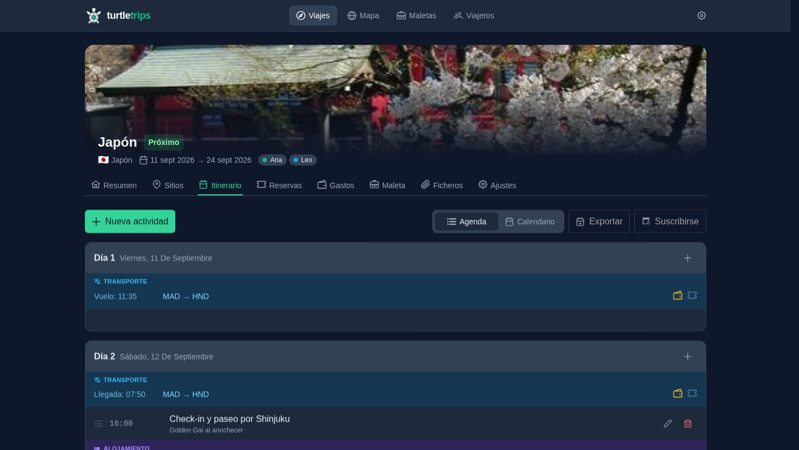
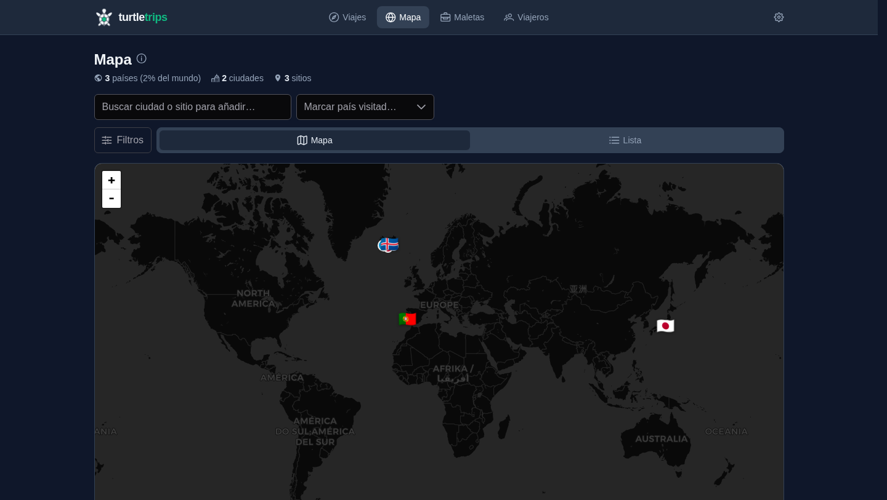
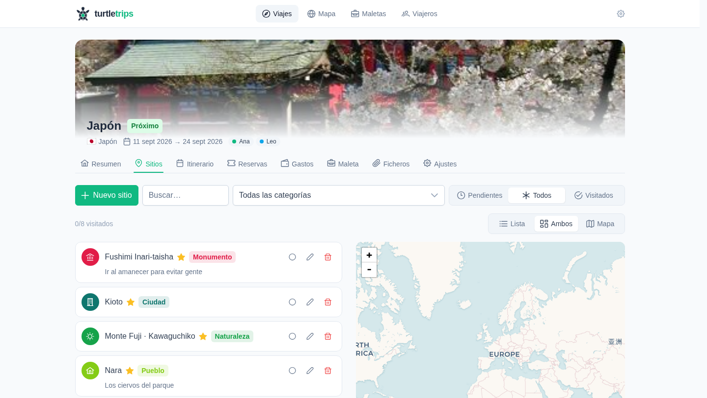
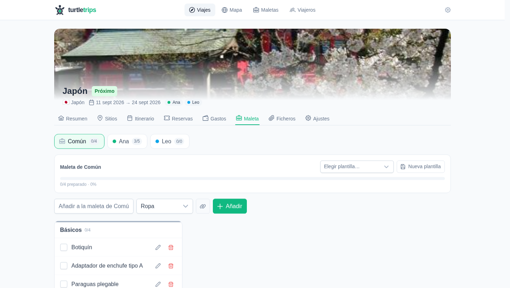

<!-- markdownlint-disable MD033 MD041 -->
<div align="center">
  <picture>
    <source media="(prefers-color-scheme: dark)" srcset="docs/logo-dark.svg">
    
  </picture>

  <h3>Plan your trips, split the expenses and take the journal with you.
  
  <br/>
  <br/>

  <div>
    
    
    
    
    
  </div>

  <br>
</div>

# Overview

Turtle Trips is a **self-hosted, multi-user** app to plan your trips: manage your itinerary, bookings, expenses and the luggage with your data on your own server. Every user is a traveler (travelers without an account — kids, guests — also exist), users group into **families** with their own world map, categories and packing templates, and a trip is shared by everyone traveling on it.

## Features

### Planning

- 🌍 **Trips** with countries (multiple, with flag and automatic cover from Wikivoyage or your own photo), dates, automatic status and budget.
- 📍 **Places to see** with categories (city, sight, nature…), priority, geocoding and a map.
- 🗓️ **Day-by-day itinerary** with drag & drop, multi-day stays and a calendar view; dated bookings (flights, hotels, activities) show up in the agenda on their own.
- 🎫 **Bookings** (hotel, flight, train, activity…) with confirmation code, flight number and attachments. A booking with a cost **creates its expense automatically** and both stay in sync in either direction; it also links itself to the nearest place on the map.
- 📅 **.ics calendar**: export the itinerary or **subscribe by URL** from Google Calendar to keep it always up to date.

### Expenses

- 💶 **Multi-currency** with cached, editable ECB exchange rates (frankfurter), configurable categories, groupings, charts and bulk editing.
- 🤝 **Splitwise-style splitting**: equal parts, amounts or percentages per expense, plus a **common fund** as a virtual payer for shared money.
- ⚖️ **Balances and settlements**: per-traveler balances, settlement suggestions and recorded payments until the trip shows "Settled".
- 📄 **CSV import/export** to migrate from Excel, with Spanish/English headers and a dry-run preview.

### Packing

- 🧳 **One packing list per traveler** (plus a shared one) with progress and categories.
- 📋 **Reusable templates**: apply one to a traveler's luggage and tweak it freely, trip after trip.

### And more

- 👥 **Multi-user with login**: session cookies with no secrets to configure, per-user theme and language stored in the database, profile page (name, color, photo, password) and an admin area to manage accounts and families. A new account can claim an existing virtual traveler.
- 🗺️ **World map**: a per-family journal of visited countries, cities and places that **fills itself in** from finished trips where the family took part, and lets you add everything from before the app by hand.
- 🌐 **Multi-language UI** ^^(English and Spanish), switchable from Settings.
- 📱 **Installable PWA** with app-shell precaching and basic offline support.
- 💾 **Backups** as a ZIP (database + files) from the app itself, with validated hot restore.

## Screenshots

|                                    🖥 Desktop                                    |                              📱 Mobile                              |
| :------------------------------------------------------------------------------: | :-----------------------------------------------------------------: |
|  |  |

| Trip overview | Multi-currency expenses |
| :---: | :---: |
|  |  |

| Itinerary | World map |
| :---: | :---: |
|  |  |

<details>
  <summary>More screenshots</summary>

| Places to see | Packing list |
| :---: | :---: |
|  |  |

</details>

## Quick start

With the image published on GHCR:

```bash
docker run -d --name tt \
  -p 8000:8000 \
  -v /path/to/your/data:/data \
  ghcr.io/zurdi15/turtletrips:latest
# → http://localhost:8000
```

Or with the repo's `docker-compose.yml` (`docker compose up -d`). All data (SQLite + uploaded files) lives in `/data`: a single directory to back up.

On first run the login screen offers to create the **admin account**; the admin then creates the rest of the users (optionally linking them to existing virtual travelers) and manages families from the Administration page.

> [!NOTE]
> The app now ships with its own login (session cookie, `HttpOnly` + `SameSite=Lax`). A reverse proxy with auth is no longer required, but if you keep one, leave `/api/v1/calendar/*` exempt: the calendar subscription is a public feed with its own token. Set `TT_COOKIE_SECURE=1` when serving over HTTPS.
>
> Locked out of the only admin account? Reset it by hand against the volume: `sqlite3 /data/app.db "DELETE FROM users; DELETE FROM sessions;"` — the next visit shows the admin bootstrap screen again (travelers, trips and data are untouched).

## Environment variables

| Variable | Default | Description |
|---|---|---|
| `TT_DATA_DIR` | `/data` | Data directory (DB at `app.db`, files under `uploads/`) |
| `TT_DEFAULT_CURRENCY` | `EUR` | Default base currency for new trips |
| `TT_NOMINATIM_URL` | `https://nominatim.openstreetmap.org` | Geocoding server (you can point it to your own) |
| `TT_RATES_URL` | `https://api.frankfurter.dev/v1` | Exchange-rate API (self-hostable) |
| `TT_COOKIE_SECURE` | `0` | Mark the session cookie as `Secure` (enable behind HTTPS) |
| `TT_SESSION_TTL_DAYS` | `30` | Session lifetime; it renews itself while the app is in use |

## Backup

From the app: **Settings → Backup** downloads a ZIP with the database and files, restorable from the same screen. By hand, copying the volume is enough:

```bash
docker run --rm -v tt_tt_data:/data -v "$PWD":/backup alpine \
  tar czf /backup/tt-backup.tar.gz -C /data .
```

## Import your expenses from Excel

1. Export your sheet to CSV (`,` or `;` separator).
2. In the trip → **Expenses** tab → **Import CSV**.
3. Headers are recognized in Spanish or English (`fecha/day`, `concepto/description`, `importe/amount`, `categoría/category`, `moneda/currency`, `tasa/rate`, `pagador/payer`, `notas/notes`), along with `dd/mm/yyyy` dates and `1.234,56` amounts.
4. You get a row-by-row preview with any errors; nothing is imported until you confirm.

If a row uses a currency other than the trip's, it needs a `rate` column (exchange rate to the base currency); if missing, the row is flagged as an error.

## Development

Requirements: [uv](https://docs.astral.sh/uv/) and Node 22+.

```bash
./dev.sh   # backend :8000 + frontend :5173, both with hot reload
```

```
frontend/   Vue 3 + Vite + TS + PrimeVue + Pinia (SPA)
backend/    FastAPI + SQLAlchemy 2 + Alembic (REST API + serves the SPA)
Dockerfile  multi-stage: frontend build → python runtime
```

API docs at `http://localhost:8000/api/docs`. Tests: `cd backend && uv run pytest` · `cd frontend && npm test`.
